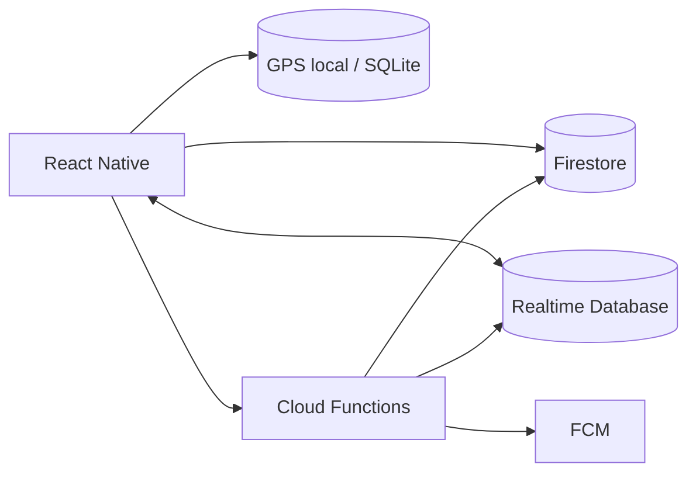

<strong>Una red de movimiento en tiempo real.</strong> MOVE WITH THE CITY.

<a href="README.md">English</a> · <a href="README.es.md">Español</a>

  
  
  
  

<a href="#qué-hace-diferente-a-trace">El producto</a> · <a href="#arquitectura-firebase-first">Arquitectura</a> · <a href="#privacidad">Privacidad</a> · <a href="#identidad-oficial">Identidad</a>

---

> **MOVE WITH THE CITY.** TRACE parte de una idea: **ver el movimiento cercano y poder unirte.** Es una base de producto en desarrollo, no un servicio público de descubrimiento en vivo ya lanzado.

## Identidad oficial

El logotipo oficial de TRACE es **blanco sobre negro** y conserva su tipografía geométrica, incluida la A abierta. README y app comparten el mismo lenguaje monocromático. El verde lima se reserva para indicar **LIVE / grabación**, no como color principal de la marca.

| Token | Color | Uso |
| --- | --- | --- |
| Negro oficial | `#050505` | Fondo |
| Blanco | `#FFFFFF` | Logotipo, texto y acciones principales |
| Superficie | `#101010` | Tarjetas y overlays |
| Indicador LIVE | `#B7FF3C` | Estado funcional y trazado de rutas |

[Logotipo oficial](brand/trace-wordmark.svg) · [Banner](brand/trace-banner.svg) · [Ícono T](brand/trace-icon.svg) · [Guía de marca](brand/README.md)

## Qué hace diferente a TRACE

La pantalla principal no comienza con estadísticas. Comienza con un mapa vivo.

El usuario puede:

- registrar running, walking y cycling;
- seguir grabando sin señal y sincronizar después;
- descubrir sesiones activas cercanas que hayan aceptado ser visibles;
- solicitar unirse a una persona o grupo;
- encontrar pacers compatibles por distancia y ritmo;
- compartir una sesión con contactos de confianza;
- recibir insights basados en sus datos reales al terminar.

## Arquitectura Firebase-first

**Firestore** guarda datos durables como perfiles, actividades terminadas, challenges y relaciones sociales.

**Realtime Database** se usa para presencia y movimiento efímero durante sesiones activas.

Los puntos GPS de alta frecuencia se registran primero de forma local y se sincronizan por lotes; no se escriben uno por uno a Firestore durante toda la actividad.

## Privacidad

TRACE no publica coordenadas exactas de desconocidos por defecto.

- presencia LIVE siempre opt-in;
- descubrimiento público con posición aproximada;
- coordenadas exactas solo cuando existe consentimiento/contexto de sesión;
- zonas sensibles de inicio/fin pueden ocultarse;
- App Check + Security Rules forman parte de la arquitectura.

Consulta [docs/PRIVACY_AND_SAFETY.md](docs/PRIVACY_AND_SAFETY.md).

## Objetivo técnico

El proyecto busca demostrar al mismo tiempo:

- Mobile Engineering;
- Realtime Systems;
- Geospatial Engineering;
- Firebase architecture;
- Offline-first sync;
- Data Engineering;
- Data Science / ML readiness;
- Product Design;
- Privacy-aware engineering.

## Estado

La primera etapa del repositorio contiene la arquitectura, modelo de datos, seguridad, reglas de Firebase, tracking offline y scaffolding de funciones server-side.

**Strava tells you what happened. TRACE shows you what is happening.**
