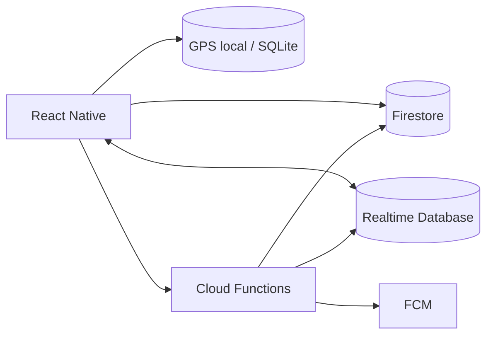

# TRACE — Red de Movimiento en Tiempo Real

[English](README.md) · [Español](README.es.md)

> **MOVE WITH THE CITY.**  
> TRACE es una plataforma móvil de running y actividad física construida alrededor de una idea: **ver movimiento ocurriendo cerca de ti y poder unirte.**

TRACE no se plantea como un clon de Strava. Su tesis de producto es una **real-time movement network**.

## Qué hace diferente a TRACE

La pantalla principal no comienza con estadísticas. Comienza con un mapa vivo.

El usuario puede:

- registrar running, walking y cycling;
- seguir grabando sin señal y sincronizar después;
- descubrir sesiones activas cercanas que hayan aceptado ser visibles;
- solicitar unirse a una persona o grupo;
- encontrar pacers compatibles por distancia y ritmo;
- compartir una sesión con contactos de confianza;
- recibir insights basados en sus datos reales al terminar.

## Arquitectura Firebase-first

**Firestore** guarda datos durables como perfiles, actividades terminadas, challenges y relaciones sociales.

**Realtime Database** se usa para presencia y movimiento efímero durante sesiones activas.

Los puntos GPS de alta frecuencia se registran primero de forma local y se sincronizan por lotes; no se escriben uno por uno a Firestore durante toda la actividad.

## Privacidad

TRACE no publica coordenadas exactas de desconocidos por defecto.

- presencia LIVE siempre opt-in;
- descubrimiento público con posición aproximada;
- coordenadas exactas solo cuando existe consentimiento/contexto de sesión;
- zonas sensibles de inicio/fin pueden ocultarse;
- App Check + Security Rules forman parte de la arquitectura.

Consulta [docs/PRIVACY_AND_SAFETY.md](docs/PRIVACY_AND_SAFETY.md).

## Objetivo técnico

El proyecto busca demostrar al mismo tiempo:

- Mobile Engineering;
- Realtime Systems;
- Geospatial Engineering;
- Firebase architecture;
- Offline-first sync;
- Data Engineering;
- Data Science / ML readiness;
- Product Design;
- Privacy-aware engineering.

## Estado

La primera etapa del repositorio contiene la arquitectura, modelo de datos, seguridad, reglas de Firebase, tracking offline y scaffolding de funciones server-side.

**Strava tells you what happened. TRACE shows you what is happening.**
