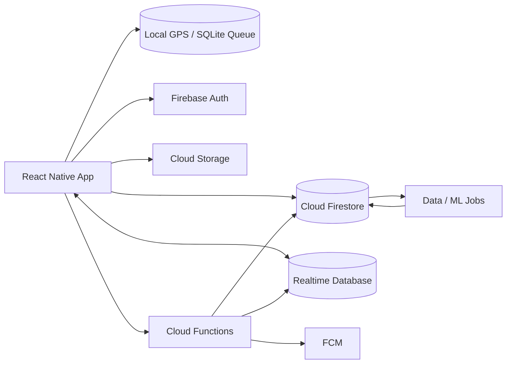

# TRACE — Live Movement Network

[English](README.md) · [Español](README.es.md)

> **MOVE WITH THE CITY.**  
> TRACE is a mobile running and movement platform built around a simple idea: **see movement happening around you, then join it.**


## The product

Most fitness apps are optimized around reviewing what already happened. TRACE is designed around **what is happening now**.

Open the app and the home screen is a live map, not a dashboard. It can surface opt-in movement nearby: active runners, group runs, public pacers, live routes, events and friends currently training.

From there a user can:

- start a run, walk or ride;
- record GPS activity offline and sync later;
- discover opt-in live sessions nearby;
- request to join a runner or group;
- find a compatible pacer by distance and target pace;
- share a live session with trusted contacts;
- finish an activity and receive data-backed performance insights;
- explore heatmaps, trends, consistency and personal records.

TRACE is **not a Strava clone**. The product thesis is a **real-time movement network**.

## Why this project matters

TRACE is intentionally designed as a flagship engineering project rather than a CRUD portfolio app. It combines problems that normally live in separate projects:

- background location tracking;
- mobile permissions and battery constraints;
- offline-first recording and sync;
- realtime presence and ephemeral location;
- geospatial discovery;
- social coordination;
- push notifications;
- privacy-aware location sharing;
- activity analytics;
- data pipelines and ML-ready features.

## Firebase-first architecture

TRACE uses Firebase as the application backend while separating durable product data from high-frequency live movement.



### Why both Firestore and Realtime Database?

**Firestore** stores durable product state: profiles, completed activities, challenges, friendships, comments, requests and computed summaries.

**Realtime Database** handles ephemeral state: active-session presence, coarse live positions, group membership and short-lived movement updates. This avoids treating every GPS sample like a permanent document.

Raw tracking samples remain on-device while the activity is in progress and are uploaded in batches when appropriate.

## Core experiences

### 1. Live map

The default screen answers one question:

> **What is moving around me right now?**

The map can represent active runners, group sessions, friends in motion, public pacers, popular live routes and city activity intensity.

Precise stranger coordinates are **never public by default**. Public discovery uses approximate or delayed presence until a join/share relationship exists.

### 2. Activity recording

The recorder is optimized for focus:

```text
4.82 KM
5:14 /KM
24:38

PAUSE
```

Engineering responsibilities include background GPS, battery-aware sampling, local persistence and recovery after connectivity loss.

### 3. Join Run

A user can request to join an opt-in session. TRACE can estimate an intercept point using current participant position, requesting user position, direction of movement, planned route when available, current/historical pace and ETA to interception.

Exact live location is revealed only after the relevant privacy/consent state is satisfied.

### 4. Find a Pacer

```text
Distance     10 KM
Target pace  5:00 /KM
Start        NOW
```

The matching layer can rank compatible opt-in runners using distance, pace history, current intensity and preferred distance.

### 5. TRACE Intelligence

The goal is not generic AI commentary. Insights must be explainable from activity data: pacing consistency, split behavior, fastest sustained segment, change versus a 30-day baseline, route difficulty and personal records.

## Repository layout

```text
trace/
├── apps/
│   └── mobile/                 # React Native + TypeScript
├── functions/                  # Firebase Cloud Functions
├── packages/
│   └── shared/                 # Shared domain types
├── docs/
│   ├── ARCHITECTURE.md
│   ├── DATA_MODEL.md
│   └── PRIVACY_AND_SAFETY.md
├── ml/                         # Modeling roadmap / future Python jobs
├── firestore.rules
├── database.rules.json
├── storage.rules
└── firebase.json
```

## Data model

Each completed activity can produce a durable summary such as:

```ts
type ActivitySummary = {
  activityType: 'run' | 'walk' | 'ride';
  startedAt: string;
  durationSec: number;
  distanceM: number;
  averagePaceSecPerKm?: number;
  elevationGainM?: number;
  routeRef?: string;
  privacy: 'private' | 'friends' | 'public';
};
```

High-frequency GPS samples are not intended to live as thousands of individual Firestore writes during a run. TRACE records locally, then persists an optimized route representation after the activity.

See [docs/DATA_MODEL.md](docs/DATA_MODEL.md).

## Offline-first recording

```text
GPS samples
    ↓
local queue
    ↓
activity continues with no signal
    ↓
network returns
    ↓
batched sync
    ↓
idempotent activity finalization
```

Starter implementations:
- `apps/mobile/src/features/activity/tracking/ActivityRecorder.ts`
- `apps/mobile/src/features/sync/syncPendingActivities.ts`

## Privacy & safety by design

A real-time movement product can become unsafe if location is treated as ordinary social data. TRACE therefore treats precise location as a privileged capability.

Core rules:

- live presence is opt-in;
- stranger discovery uses coarse location;
- home/start/end zones can be automatically masked;
- exact session location requires an accepted relationship or explicit share;
- users can disable discoverability at any moment;
- safety sharing is scoped to trusted contacts;
- completed routes can be private, friends-only or public;
- App Check and Firebase Security Rules are part of the architecture.

Read [docs/PRIVACY_AND_SAFETY.md](docs/PRIVACY_AND_SAFETY.md).

## Firebase services

| Capability | Firebase service |
|---|---|
| Identity | Firebase Authentication |
| Durable product data | Cloud Firestore |
| Live presence / coarse movement | Realtime Database |
| Server-side orchestration | Cloud Functions |
| Media / route artifacts | Cloud Storage |
| Push notifications | Firebase Cloud Messaging |
| Client integrity | Firebase App Check |
| Crash diagnostics | Crashlytics |

## ML roadmap

TRACE is structured so product usage can later support real data-science work with explicit consent and privacy controls.

Potential models:
- expected pace prediction;
- pacer compatibility ranking;
- route difficulty estimation;
- route clustering;
- training consistency scoring;
- anomaly detection;
- personalized challenge recommendations.

No public model-performance claims should be made until they are measured on real held-out data.


## Run the mobile app

TRACE uses **Expo SDK 57 / React Native 0.86** with a custom development client. Mapbox and React Native Firebase include native code, so **Expo Go is not supported for this project**.

```bash
git clone https://github.com/armaabetancourtt/trace.git
cd trace
npm install
cp .env.example .env
```

Then configure a Mapbox public token and the native Firebase app files before generating the iOS/Android projects.

Full setup: [docs/LOCAL_DEVELOPMENT.md](docs/LOCAL_DEVELOPMENT.md).

## Current implementation

The repository now contains working product foundations rather than only architecture documents:

- fullscreen live-map mobile shell;
- RUN / WALK / RIDE recording flow;
- background location task;
- SQLite-backed offline activity persistence;
- activity state machine with pause/resume/finish;
- route, distance, pace, duration and elevation primitives;
- explainable pacer ranking;
- JOIN RUN interception baseline;
- Firebase callable JOIN RUN trust flow;
- coarse-public vs. session-scoped precise location separation.

The next milestone is live discovery + authenticated user onboarding, followed by post-activity TRACE Intelligence.

## Status

**Mobile foundation is implemented.** The repository now includes the native-capable React Native shell, Mapbox UI, background recording, SQLite persistence, Firebase security boundaries and the first JOIN RUN server flow. Real Firebase project credentials and live user discovery are intentionally not fabricated in source control.

**Strava tells you what happened. TRACE shows you what is happening.**
