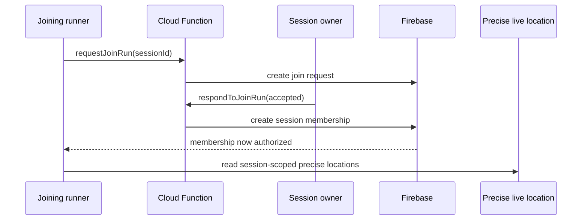

# TRACE Architecture

## Design goal

TRACE must support two very different data modes:

1. **durable product state** — profiles, completed activities, challenges, friendships, requests;
2. **ephemeral live movement** — presence, approximate live positions, session membership and short-lived coordination.

Using one storage pattern for both would create unnecessary cost, privacy risk and write amplification.

## Mobile client

React Native + TypeScript is the primary client.

The client is responsible for:

- foreground/background location permission handling;
- battery-aware GPS sampling;
- local activity persistence;
- offline recovery;
- live map rendering;
- privacy state and discoverability controls;
- batching route samples for upload.

## Firebase split

### Firestore

Use for durable documents:

- users;
- activities;
- friendships;
- join requests;
- challenges;
- computed insights;
- route metadata.

### Realtime Database

Use for highly dynamic state:

- active session presence;
- coarse location cells;
- session participant membership;
- precise session location after acceptance;
- live pace/status;
- ephemeral pacer availability.

### Cloud Functions

Sensitive state transitions run through callable Functions with Auth and App Check:

- create JOIN RUN requests;
- accept/decline JOIN RUN requests;
- grant/revoke session membership;
- fan-out notifications;
- finalize activity summaries;
- compute derived metrics;
- clean stale presence.

## JOIN RUN trust boundary

A client cannot directly add itself to `sessionMembers`. Firebase Admin inside Cloud Functions performs the trusted membership write.

## Route storage

During a run, samples live in a local queue. At completion the client produces a normalized route artifact and summary.

A practical representation can be:

- encoded polyline / compressed coordinate series;
- optional detailed route file in Cloud Storage;
- summary metrics in Firestore.

This avoids thousands of permanent Firestore documents per activity.

## Realtime privacy boundary

Public discovery uses coarse location rather than exact coordinates.

Exact location is stored under a session-scoped path. Realtime Database rules only allow reading that path when the caller owns the session or has server-granted membership.

## Interception engine

The first implementation is deliberately deterministic:

1. walk the remaining route;
2. estimate runner ETA at future points;
3. estimate joiner ETA;
4. choose a point minimizing late arrival.

The baseline lives in `packages/shared/src/interception.ts`. A later version can replace straight-line joiner distance with Mapbox pedestrian routing.

## Future ML

Training datasets should be generated from explicitly consented and de-identified activity data. Raw public live coordinates should never become an unrestricted analytics dataset.
